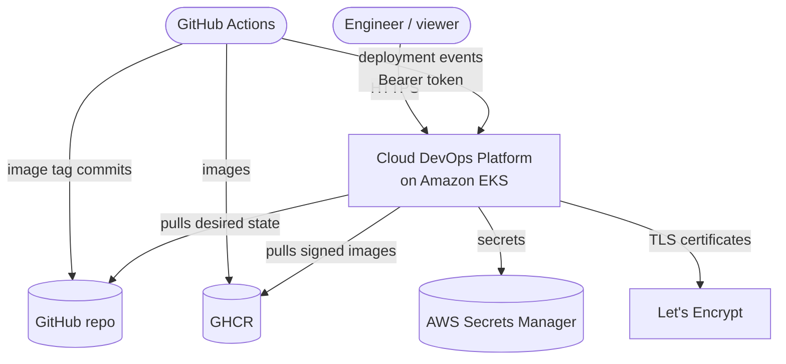
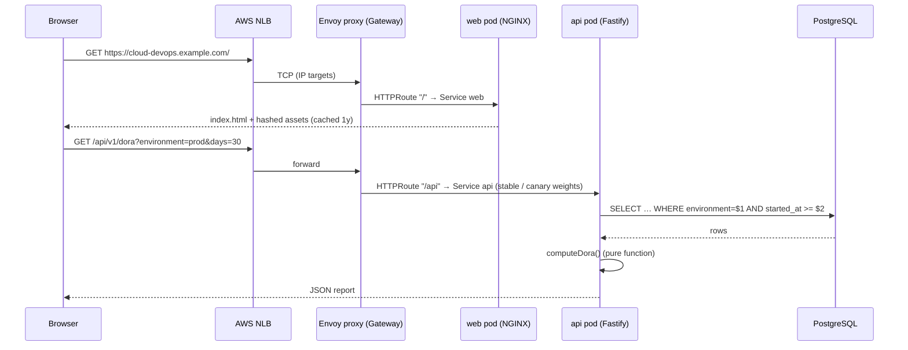
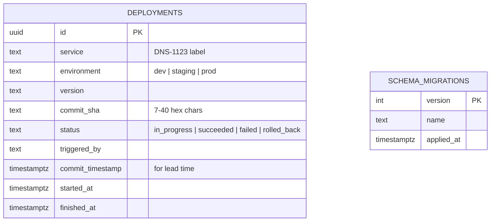
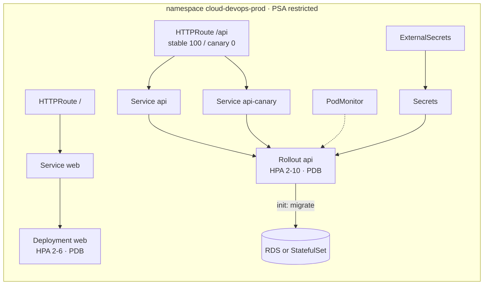
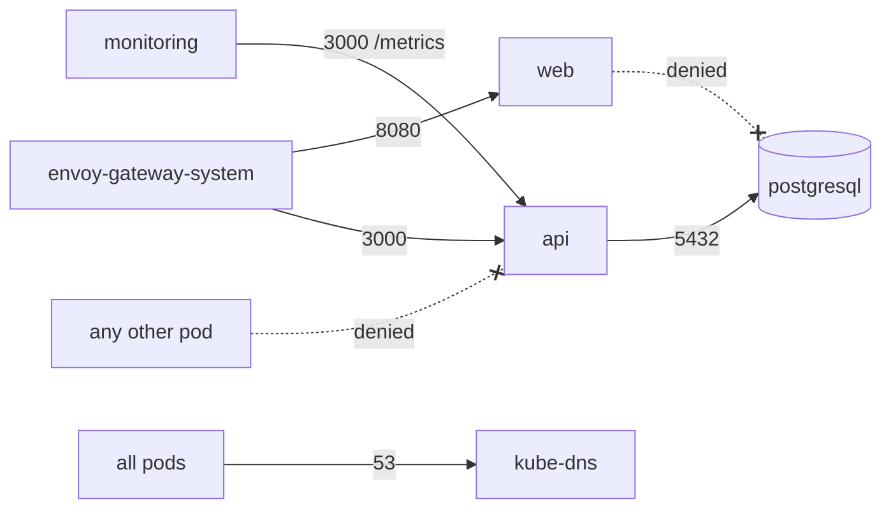
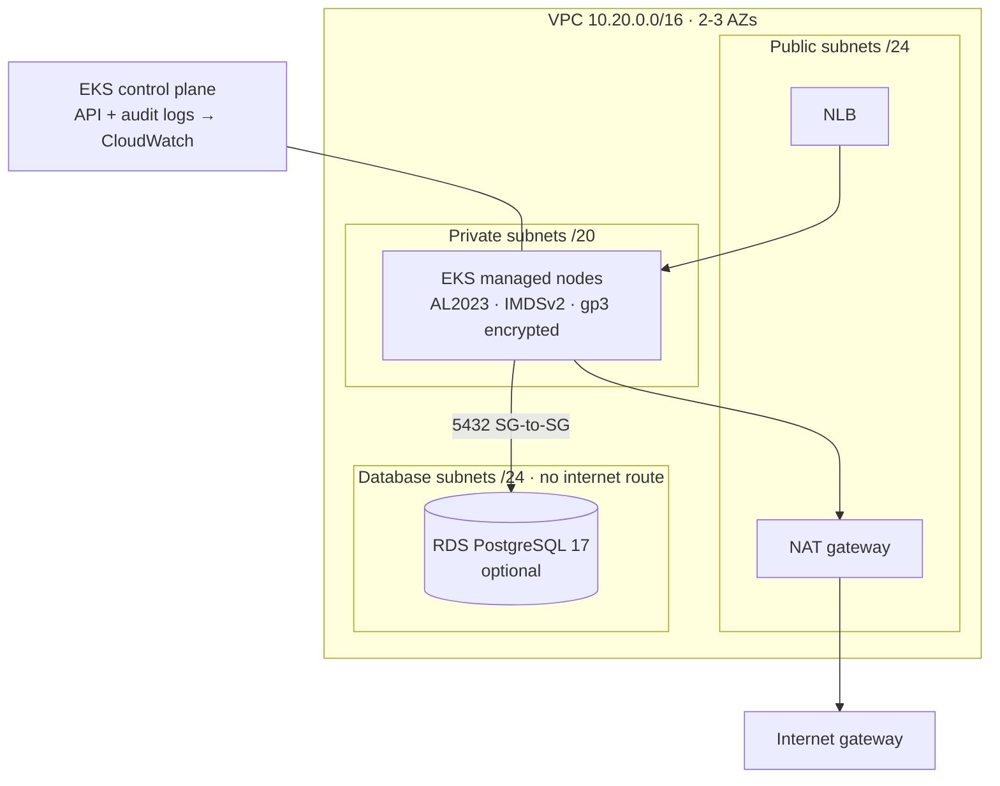
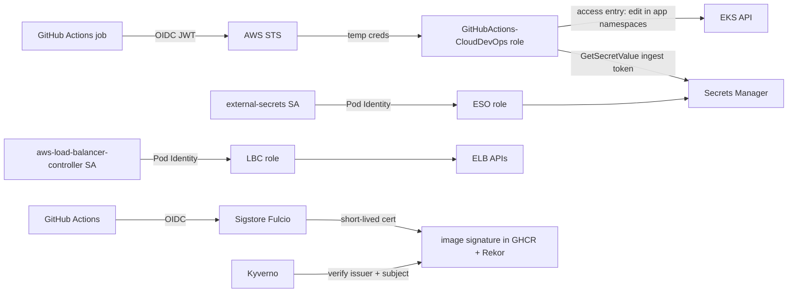

# Architecture

This document explains how the Cloud DevOps Platform is put together, from a single HTTP request up to the AWS account. Each design choice links to an [Architecture Decision Record](adr/).

## 1. System context

The platform has two kinds of users: **people** who look at delivery performance in the dashboard, and **pipelines** that report deployments to the API.

## 2. Application

### 2.1 Components

| Component | Tech | Responsibility |
|---|---|---|
| `web` | React 19 + Vite, served by `nginx-unprivileged` | Dashboard: four DORA tiles, daily deployments chart, service × environment matrix, recent deployments, platform info (which pod served the request) |
| `api` | Node.js 22, Fastify 5, zod, node-postgres, prom-client | Deployment ingest, DORA computation, health and metrics endpoints |
| `postgresql` | PostgreSQL 17 | Durable store for deployment events |

The web tier is static: the browser calls `/api/v1/*` on the same origin, and the Gateway routes `/api` to the API service. Same-origin serving removes CORS entirely and lets the Content-Security-Policy stay at `connect-src 'self'`.

### 2.2 Request path

### 2.3 API design

* **Layering:** `server.ts` (HTTP, validation, auth) → `DeploymentRepository` interface → `PostgresRepository` or `MemoryRepository`. The DORA maths lives in `domain/dora.ts` as pure functions, so it is tested without any I/O.
* **Validation:** every request body and query string is parsed by a zod schema; invalid input returns `400` with field-level issues.
* **Auth:** write endpoints require `Authorization: Bearer <INGEST_TOKEN>`. Tokens are compared as SHA-256 digests with `crypto.timingSafeEqual` (constant time, equal length).
* **Resilience:** `/healthz` checks only the process (used by liveness), `/readyz` also pings the database (used by readiness) — a database outage removes pods from load balancing without restart storms. On `SIGTERM` the API fails readiness first, keeps serving for `SHUTDOWN_DELAY_MS`, then closes the server and pool.
* **Migrations:** versioned SQL in code, applied inside a transaction under a PostgreSQL advisory lock, run as an init container — replicas starting together never race.
* **Telemetry:** RED metrics (`http_requests_total`, `http_request_duration_seconds`) labelled by route template (bounded cardinality), a business counter `deployments_recorded_total`, Node.js runtime metrics, and JSON logs with request IDs.

### 2.4 Data model

Indexes on `(environment, started_at DESC)` and `(service, environment, started_at DESC)` serve the two hot queries (window scans and "latest per service").

### 2.5 DORA calculations

| Metric | Definition used | Elite | High | Medium | Low |
|---|---|---|---|---|---|
| Deployment frequency | successful deployments ÷ days in window | ≥ 1/day | ≥ 1/week | ≥ 1/month | less |
| Lead time for changes | median(`finished_at` − `commit_timestamp`) of successful deployments | < 1 day | < 1 week | < 1 month | more |
| Change failure rate | (failed + rolled back) ÷ finished deployments | ≤ 5% | ≤ 10% | ≤ 15% | more |
| Time to restore | median time from a failure to the next success of the same service | < 1 h | < 1 day | < 1 week | more |

## 3. Kubernetes design

### 3.1 Workloads per environment namespace

### 3.2 Pod hardening (every container)

* `runAsNonRoot`, explicit UID/GID, `seccompProfile: RuntimeDefault`
* `readOnlyRootFilesystem: true` with small `emptyDir` volumes for `/tmp`
* `allowPrivilegeEscalation: false`, `capabilities: drop: [ALL]`
* `automountServiceAccountToken: false` — workloads never call the Kubernetes API
* Requests and limits on every container; topology spread across zones and nodes
* Namespaces enforce **Pod Security Admission `restricted`**; Kyverno additionally audits/enforces read-only root FS, probes, registries, tags and signatures

### 3.3 Availability

| Mechanism | Setting | Effect |
|---|---|---|
| Rolling update / canary | `maxUnavailable: 0`, `maxSurge: 1` | capacity never drops during a release |
| Startup / readiness / liveness probes | separate endpoints | slow starts tolerated; DB outages don't restart pods |
| `preStop` sleep + shutdown drain | 5 s | endpoints are removed before the process stops |
| PodDisruptionBudget | `minAvailable: 1`, `unhealthyPodEvictionPolicy: AlwaysAllow` | node drains keep a replica; stuck pods don't block drains |
| HPA | CPU 70%, memory 80%, fast scale-up / slow scale-down | absorbs load spikes, avoids flapping |
| Topology spread | zone then hostname | an AZ or node failure doesn't take all replicas |

### 3.4 Network policy (zero trust inside the cluster)

A namespace-wide **default deny** (ingress and egress) is followed by explicit allows. The e2e suite proves an unlabelled pod cannot reach the API or the database.

## 4. Platform (cluster add-ons)

All add-ons are Argo CD Applications declared in `gitops/bootstrap/values.yaml` and installed in **sync waves**:

| Wave | Add-on | Why it is needed |
|---|---|---|
| −10 | AppProjects | permission boundaries for platform vs. application |
| −4 | AWS Load Balancer Controller | provisions the NLB for the Gateway |
| −3 | Envoy Gateway (+ Gateway API CRDs) | north-south traffic, HTTPRoutes |
| −2 | cert-manager, External Secrets, Argo Rollouts, Kyverno, kube-prometheus-stack | CRDs and controllers the apps rely on |
| −1 | Loki, Grafana Alloy | log storage and collection |
| 0 | platform-config | Gateway, GatewayClass/EnvoyProxy, ClusterIssuer, ClusterSecretStore, Kyverno policies, plugin RBAC |
| 10 | cloud-devops-dev / -prod | the application |

## 5. AWS infrastructure

| Concern | Implementation |
|---|---|
| Cluster access | EKS **access entries** (API auth mode) — Terraform's identity is admin; the GitHub Actions role can only *edit* the two app namespaces |
| Workload IAM | **EKS Pod Identity** roles for EBS CSI, Load Balancer Controller and External Secrets (each limited to its own service account) |
| CI → AWS | GitHub **OIDC** federation; trust restricted to `main` and the `dev`/`prod` environments of this repository |
| Secrets | AWS Secrets Manager (ingest token, per-env DB passwords, RDS-managed master password) synced by External Secrets |
| State | S3 bucket with versioning, KMS encryption, TLS-only policy, native lock files |
| Logging | VPC flow logs, EKS control-plane logs, RDS logs to CloudWatch |

## 6. Identity flows

No long-lived credentials exist anywhere: not in GitHub, not in the cluster, not in Terraform state (the RDS password is generated by RDS itself).
