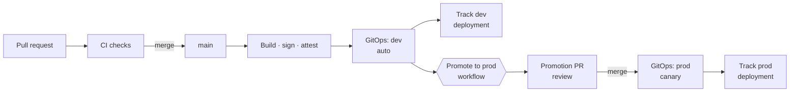
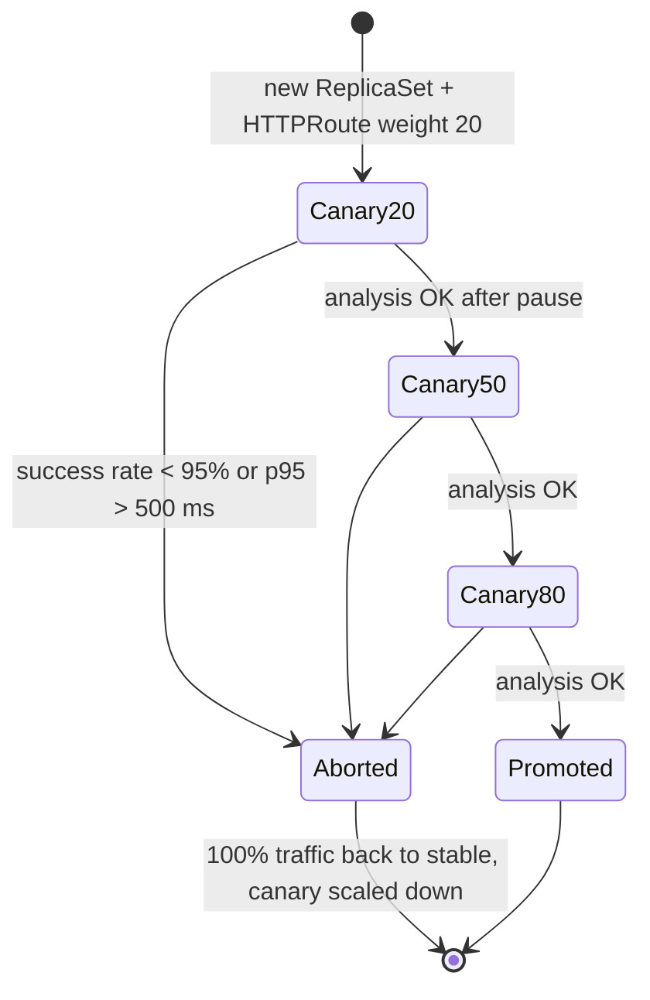

# Delivery pipeline

Code reaches production through four automated stages and one human decision.

## 1. Continuous integration (`.github/workflows/ci.yml`)

Runs on every pull request and every push to `main`. Jobs run in parallel where possible.

| Job | What it proves | Tools |
|---|---|---|
| **App** | code compiles, is lint-clean, and behaves correctly (unit, component and PostgreSQL integration tests, coverage report) | ESLint, `tsc`, Vitest, Testing Library, Postgres service container |
| **Manifests** | every chart renders for every supported configuration, matches Kubernetes and CRD schemas, follows best practice, and rejects bad input | Helm lint + `values.schema.json`, kubeconform, kube-linter, negative tests |
| **Terraform** | infra code is formatted, valid, lint-clean, and its security intent holds (plan-level assertions with mocked providers) | `terraform fmt/validate/test`, tflint |
| **Security** | no critical CVEs, leaked secrets or IaC misconfigurations; workflows are valid; new dependencies are safe | Trivy, CodeQL, actionlint, dependency review |
| **Images** (api, web) | images build for amd64 + arm64, carry an SBOM and SLSA provenance, have no fixable critical CVEs, and are signed | BuildKit, Trivy, cosign (keyless), GitHub attestations |
| **E2E** | the chart works on a real cluster: smoke tests, ingest → DORA on PostgreSQL, auth, NetworkPolicy isolation, zero-downtime restart | kind, Helm, `scripts/e2e.sh` |

All third-party actions are pinned to full commit SHAs (Dependabot keeps them current), and each job declares the minimum `permissions` it needs.

### Image tags

| Event | Tags |
|---|---|
| push to `main` | `<full commit SHA>` (immutable, used for deployment), `main` |
| tag `v1.2.3` | `1.2.3`, `1.2` |
| pull request | built and scanned locally, not pushed |

## 2. Continuous delivery with GitOps

The pipeline never runs `kubectl apply` or `helm upgrade` against the cluster during normal releases. Instead:

1. `deploy-dev` rewrites `gitops/environments/dev/values.yaml → global.imageTag` to the commit SHA and pushes the commit.
2. Argo CD (inside the cluster) notices the change, renders the Helm chart with the dev values, and applies the difference.
3. Argo Rollouts runs the canary (below).

Benefits: Git is the audit log of every change to every environment; the cluster pulls (no inbound credentials for CI); drift is corrected automatically (`selfHeal`); rollback is `git revert`.

## 3. Progressive delivery (canary)

The API is a `Rollout`. The dev environment runs 25% → 50% → 100%; prod runs 20% → 50% → 80% → 100% with pauses between steps.

* **Traffic split:** the Argo Rollouts Gateway API plugin edits the backend weights on the API's `HTTPRoute` — precise percentages independent of replica counts. Argo CD is told to ignore those weight fields so it doesn't fight the controller.
* **Analysis:** an `AnalysisTemplate` queries Prometheus every minute for the canary pods only (selected by the `rollouts_pod_template_hash` label that the `PodMonitor` attaches):
  * success rate = non-5xx ÷ all requests ≥ 0.95
  * p95 latency ≤ 0.5 s
* **Automatic rollback:** one failed measurement aborts the rollout and returns all traffic to the stable version. Try it with the [chaos demo](demo-guide.md#5-automated-canary-rollback).

## 4. Promotion to production (`promote.yml`)

A manual `workflow_dispatch` with an optional tag (defaults to whatever dev runs):

1. Requires approval if the `prod` GitHub environment has required reviewers.
2. Refuses anything that is not an immutable 40-character SHA.
3. Verifies the cosign signatures of both images were produced by this repo's CI on `main`.
4. Opens a pull request changing only `gitops/environments/prod/values.yaml`.

Merging the PR *is* the release. The PR description links the code diff between the current and the new version.

## 5. Deployment tracking — the platform measures itself (`record-deployment.yml`)

After every dev deployment (called from CI) and every prod merge (push trigger):

1. POST `/api/v1/deployments` with `status: in_progress`, the commit SHA and the commit timestamp.
2. Poll `<env URL>/api/v1/info` until the reported version equals the new SHA (Argo CD sync + canary).
3. PATCH the deployment to `succeeded` (or `failed` after 20 minutes).

The difference between the commit time and the moment the version is live is the real **lead time for changes**, and failed or aborted rollouts feed the **change failure rate**.

Configure it with repository variables `DORA_API_URL`, `DEV_URL`, `PROD_URL` and either `AWS_ROLE_ARN` (token read from Secrets Manager via OIDC) or a `INGEST_TOKEN` secret. Without them the job is skipped with a notice.

## 6. Rollback options

| Situation | Action |
|---|---|
| Canary unhealthy | automatic (Argo Rollouts abort) |
| Bad version already fully promoted | `git revert` the image-tag commit (or re-run *Promote to prod* with the previous SHA) |
| Need to stop a rollout now | `kubectl argo rollouts abort cloud-devops-api -n cloud-devops-prod` |
| Argo CD unavailable | *Break-glass Helm deploy* workflow (`deploy-eks.yml`, dry-run by default) |

## 7. Branch protection (recommended settings)

* Require the CI checks `App · test & build`, `Helm & GitOps manifests`, `Terraform · …`, `Security scans`, `E2E · kind cluster` before merging to `main`.
* Require 1 approving review; dismiss stale approvals; require CODEOWNERS review for `infra/`, `gitops/`, `.github/workflows/`.
* Allow `github-actions[bot]` to bypass the PR requirement **only** for `gitops/environments/dev/values.yaml` (or use a GitHub App / deploy key for the dev bump).
* Settings → Actions → General: enable *Allow GitHub Actions to create and approve pull requests* (for promotion PRs).
