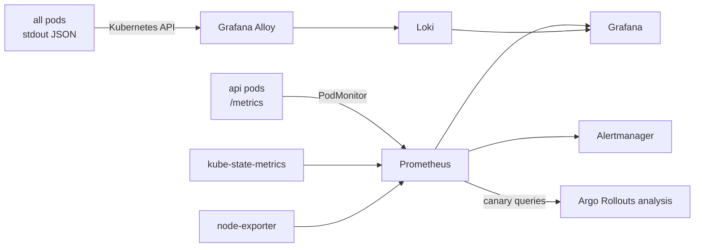

# Observability

The platform follows the **RED method** for services (Rate, Errors, Duration) and the **USE method** for resources (Utilisation, Saturation, Errors), with logs correlated in the same Grafana.



## Metrics

| Metric | Type | Labels | Use |
|---|---|---|---|
| `http_requests_total` | counter | `method`, `route`, `status_code` | traffic and error ratio |
| `http_request_duration_seconds` | histogram | `method`, `route`, `status_code` | latency percentiles |
| `deployments_recorded_total` | counter | `service`, `environment`, `status` | delivery events (business metric) |
| `process_*`, `nodejs_*` | various | — | CPU, memory, event-loop lag, GC |

`route` is the route **template** (`/api/v1/deployments/:id`), never the raw URL, which keeps label cardinality bounded. Probe and metrics endpoints are excluded from RED metrics.

The chart uses a **PodMonitor** rather than a ServiceMonitor: during a canary, Argo Rollouts rewrites Service selectors, and scraping pods directly guarantees every pod is scraped exactly once. The PodMonitor copies the `rollouts-pod-template-hash` pod label into the series, which is how canary analysis isolates the new version's traffic.

## Dashboard

`helm/cloud-devops/dashboards/cloud-devops-api.json` (provisioned in-cluster via the Grafana sidecar and in Docker Compose via file provisioning):

* **Golden signals:** request rate, 5xx ratio, p95 latency, pods up
* **Traffic:** requests per route, responses by status, requests per pod (shows load balancing and HPA scale-out)
* **Runtime:** CPU and memory per pod, event-loop lag p99
* **Delivery:** deployment events by environment and status

## Alerts

Defined once in `helm/cloud-devops/files/alert-rules.yaml`, used by both Docker Compose and the `PrometheusRule`:

| Alert | Condition | Severity |
|---|---|---|
| `CloudDevopsApiDown` | `up == 0` for 2 m | critical |
| `CloudDevopsApiHighErrorRate` | 5xx ratio > 5% for 5 m | critical |
| `CloudDevopsApiHighLatency` | p95 > 500 ms for 10 m | warning |
| `CloudDevopsProdDeploymentFailures` | > 2 failed prod deployments in 1 h | warning |
| `CloudDevopsPodCrashLooping` | > 3 restarts in 15 m | warning |
| `CloudDevopsHpaMaxedOut` | HPA at max replicas for 15 m | warning |

## Service level objectives

| SLI | SLO | Where enforced |
|---|---|---|
| Availability (non-5xx share) | ≥ 99.5% over 30 days | alert at 5% error ratio; canary gate at 95% success |
| Latency (p95 of dashboard API calls) | < 500 ms | alert; canary gate; k6 threshold |
| Deployment safety | failed canaries never reach 100% | Argo Rollouts analysis |

## Logs

The API writes one JSON object per line (pino) with `level`, `time`, `msg`, `reqId`, `service`, `version` and `pod`; the `authorization` header is redacted. Grafana Alloy tails pod logs through the Kubernetes API (no privileged `hostPath` mounts), adds `namespace`, `pod`, `container`, `app`, `component` labels, promotes `level`, and ships to Loki.

Useful LogQL queries:

```logql
{namespace="cloud-devops-prod", component="api"} | json | level >= 50          # errors
{namespace="cloud-devops-prod", component="api"} | json | msg="deployment recorded"
sum by (pod) (rate({namespace="cloud-devops-prod", component="api"}[5m]))       # log volume per pod
```
