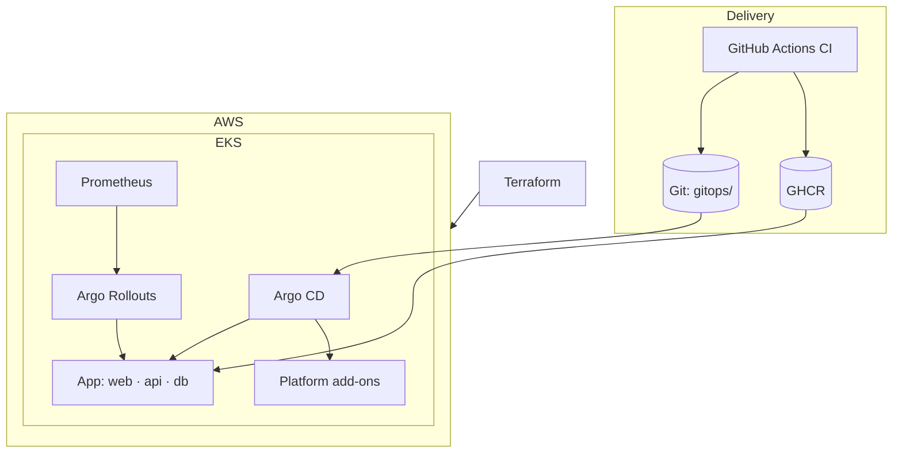
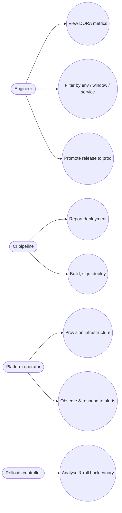
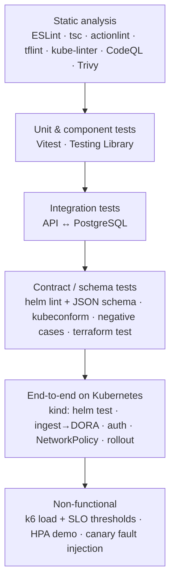

# Cloud DevOps Platform: A Self-Measuring, Secure Continuous Delivery Platform on Amazon EKS

**Final Year Project Report**

| | |
|---|---|
| Submitted by | *[Your Name]* (*[Roll / Registration No.]*) |
| Guide | *[Guide Name], [Designation]* |
| Department | *[Department of Computer Science & Engineering]* |
| Institution | *[College / University]* |
| Academic year | 2026–27 |
| Repository | https://github.com/yuvi1-1/cloud-devops-platform |

> Fields in *[brackets]* are placeholders for your institution's format. Sections marked **📋 Record after deployment** contain tables to fill with measurements from your own AWS run — do not invent values.

---

## Abstract

Software organisations are increasingly evaluated on how quickly and safely they can deliver change. Research by the DevOps Research and Assessment (DORA) programme identifies four key metrics — deployment frequency, lead time for changes, change failure rate and time to restore service — that predict both delivery and organisational performance. Yet most academic DevOps projects demonstrate isolated tools (a container, a pipeline, a cluster) without integrating them into a platform whose safety and performance can be measured.

This project designs and implements the **Cloud DevOps Platform**, an end-to-end, production-grade delivery platform on Amazon Elastic Kubernetes Service (EKS) that ships a full-stack DORA metrics application and **records its own deployments into that application**. Infrastructure is provisioned with Terraform; delivery follows the GitOps model with Argo CD; releases are progressive canaries controlled by Argo Rollouts and gated on Prometheus metrics with automatic rollback; north-south traffic uses the Kubernetes Gateway API (Envoy Gateway), replacing the ingress-nginx controller retired in 2026; and the software supply chain is secured with keyless image signing (Sigstore cosign), SBOMs, provenance attestations and admission policies (Kyverno). No long-lived credentials are used anywhere: GitHub Actions federates to AWS with OpenID Connect, workloads use EKS Pod Identity, and secrets flow from AWS Secrets Manager through the External Secrets Operator.

The platform is validated by a layered test strategy — 35 unit, component and integration tests (96% statement coverage of the API), schema and policy validation of every Kubernetes manifest combination, offline Terraform tests with mocked providers, end-to-end tests on a disposable Kubernetes cluster that verify authentication, persistence, network isolation and zero-downtime rollout, and load tests with service-level thresholds. Compared with the project's first iteration, the platform removes all manual infrastructure steps and static credentials, adds automated rollback for faulty releases, and makes delivery performance observable.

**Keywords:** DevOps, Kubernetes, Amazon EKS, GitOps, Argo CD, progressive delivery, canary release, Gateway API, Terraform, DevSecOps, software supply chain security, DORA metrics, observability.

---

## Table of contents

1. [Introduction](#1-introduction)
2. [Literature survey](#2-literature-survey)
3. [Requirements analysis](#3-requirements-analysis)
4. [System design](#4-system-design)
5. [Implementation](#5-implementation)
6. [Testing](#6-testing)
7. [Results and discussion](#7-results-and-discussion)
8. [Conclusion and future scope](#8-conclusion-and-future-scope)
9. [References](#9-references)
10. [Appendices](#10-appendices)

---

## 1. Introduction

### 1.1 Background

Modern applications are built from containerised services deployed many times per day onto shared, elastic infrastructure. Kubernetes has become the de-facto substrate for such workloads, and public clouds offer it as a managed service (Amazon EKS, Google GKE, Azure AKS). Around the cluster, an ecosystem of tools automates the path from source code to production: continuous integration (CI), container registries, infrastructure as code (IaC), deployment controllers, progressive delivery, observability and policy enforcement. Assembling these into a coherent, secure *platform* is the core work of platform engineering teams.

### 1.2 Motivation

The first iteration of this project (v1) containerised a React application and deployed it to EKS with Helm through GitHub Actions. It worked, but exposed typical weaknesses:

* infrastructure created by hand with `eksctl` and console steps, which failed in non-reproducible ways (a node group stuck in `CREATING`, a lost network connection during creation);
* a pipeline that pushed directly into the cluster using cloud credentials;
* no way to detect a bad release other than users noticing;
* no measurement of whether delivery was getting better or worse;
* the deployed "application" was the framework's starter page.

v2 addresses each weakness and turns the project into a platform whose quality can be demonstrated with evidence.

### 1.3 Problem statement

*Design and implement a cloud-native delivery platform that (a) provisions and operates Kubernetes infrastructure entirely as code, (b) releases changes continuously, safely and without static credentials, (c) automatically detects and reverts faulty releases, and (d) measures its own delivery performance using the four DORA metrics.*

### 1.4 Objectives

1. Build a full-stack application that ingests deployment events and computes the four DORA metrics with performance classification.
2. Package it as hardened, minimal, multi-architecture container images and a configurable Helm chart.
3. Provision AWS networking, EKS, identity and data services with tested Terraform code.
4. Deliver all cluster add-ons and application environments through GitOps (Argo CD).
5. Release the API through metric-gated canary deployments with automatic rollback.
6. Secure the supply chain (scanning, SBOM, provenance, signatures, admission policies) and eliminate static credentials.
7. Provide observability (metrics, dashboards, alerts, logs) and service-level objectives.
8. Close the loop: the pipeline reports its deployments, so the dashboard shows the platform's own DORA metrics.
9. Verify everything with automated tests at every layer, runnable locally without cloud cost.

### 1.5 Scope

In scope: one AWS region, one EKS cluster hosting `dev` and `prod` namespaces, a single application composed of web, API and database tiers, GitHub as source control and CI. Out of scope: multi-region failover, multi-tenancy for many teams, service mesh, cost-allocation tooling.

### 1.6 Organisation of the report

Chapter 2 reviews the literature behind each technique. Chapter 3 specifies requirements. Chapter 4 presents the architecture and design decisions. Chapter 5 describes the implementation. Chapter 6 covers the testing strategy and results, Chapter 7 discusses outcomes, and Chapter 8 concludes with future work.

---

## 2. Literature survey

### 2.1 Continuous delivery and DevOps

Humble and Farley [1] defined *continuous delivery* as keeping software always releasable through an automated *deployment pipeline* in which every change is built, tested and promoted through environments. The DevOps movement [2] broadened this to organisational practices — flow, feedback and continual learning. The ideas in this project (small batches, automated testing gates, trunk-based development, environments as code) originate here.

### 2.2 Measuring delivery performance: DORA

Forsgren, Humble and Kim [3] analysed survey data from tens of thousands of professionals and found four metrics — **deployment frequency, lead time for changes, change failure rate and time to restore service** — that cluster organisations into performance bands and correlate with organisational outcomes. The annual State of DevOps reports [4] refine the thresholds; Google's open-source *Four Keys* project demonstrated computing them from pipeline events. This project implements the metrics and banding (Chapter 4.4) and, unlike survey-based assessment, derives them from real pipeline events.

### 2.3 Containers and Kubernetes

Kubernetes descends from Google's Borg and Omega cluster managers [5]: declarative desired state, controllers that continuously reconcile actual state, and labels/selectors as the grouping primitive. Features used here — Deployments, probes, Horizontal Pod Autoscaler, PodDisruptionBudgets, topology spread, NetworkPolicies and Pod Security Standards — all follow that reconciliation model. Container hardening guidance (non-root users, read-only filesystems, dropped capabilities, minimal "distroless" images) comes from the CIS Kubernetes Benchmark and the NSA/CISA Kubernetes Hardening Guide [6].

### 2.4 Infrastructure as code

Morris [7] describes IaC as defining infrastructure in version-controlled, testable code to make environments reproducible and changes reviewable. Terraform's declarative model, state, and module registry made it the dominant multi-cloud IaC tool; Terraform 1.7 added native testing with mocked providers, which this project uses to test infrastructure intent without creating resources.

### 2.5 GitOps

GitOps, formalised by the OpenGitOps principles [8], requires that the desired system state is **declarative, versioned and immutable, pulled automatically, and continuously reconciled**. Argo CD and Flux implement it for Kubernetes. Compared with CI-push deployment, GitOps removes cluster credentials from CI, provides an audit trail, and self-heals drift.

### 2.6 Progressive delivery

Canary releasing [9] exposes a new version to a small fraction of users and compares its behaviour with the stable version before full rollout; site reliability engineering literature [10] recommends automating that comparison against service-level indicators. Argo Rollouts and Flagger implement automated canary analysis on Kubernetes. This project uses Argo Rollouts with Prometheus-based analysis of success rate and latency.

### 2.7 Kubernetes networking: from Ingress to Gateway API

The original `Ingress` API is limited (no traffic weighting, no role separation, controller-specific annotations). The **Gateway API** [11], generally available since 2023, models infrastructure provider, cluster operator and application developer roles with `GatewayClass`, `Gateway` and `*Route` resources, and supports weighted backends natively. In November 2025 Kubernetes SIG Network announced the retirement of the community ingress-nginx controller, with maintenance ending in March 2026 [12], making migration to Gateway API implementations such as Envoy Gateway a practical necessity.

### 2.8 Observability

Google's SRE book [10] introduces the *four golden signals* (latency, traffic, errors, saturation); Wilkie's RED method (rate, errors, duration) and Gregg's USE method (utilisation, saturation, errors) give practical checklists. Prometheus's pull-based, label-oriented time-series model and PromQL are the standard for Kubernetes; Loki applies the same label model to logs.

### 2.9 Software supply chain security

High-profile supply-chain attacks motivated frameworks such as **SLSA** (Supply-chain Levels for Software Artifacts) [13], which grades build integrity by provenance and build-platform guarantees. **Sigstore** [14] enables *keyless* signing: a short-lived certificate is issued to a workload's OIDC identity and the signature is recorded in a public transparency log (Rekor), removing key management. Admission controllers (Kyverno, OPA Gatekeeper) enforce policies, including signature verification, at deploy time.

### 2.10 Identity without static credentials

Cloud providers support OIDC federation from CI systems (GitHub Actions → AWS STS) and workload identity for pods (IRSA, and since 2023 EKS Pod Identity), eliminating long-lived access keys — consistently ranked among the leading causes of cloud breaches.

### 2.11 Gap analysis

Existing academic and tutorial projects typically demonstrate one or two of these practices in isolation. Few integrate IaC, GitOps, progressive delivery, supply-chain security and observability into one coherent system, and fewer still *measure* the resulting delivery performance. This project addresses that gap.

---

## 3. Requirements analysis

### 3.1 Functional requirements

| ID | Requirement |
|---|---|
| FR1 | The API shall accept deployment events (service, environment, version, commit SHA, status, timestamps) from authenticated clients. |
| FR2 | The API shall update a deployment's status and completion time. |
| FR3 | The API shall compute the four DORA metrics for a chosen environment, time window and optional service, with performance bands. |
| FR4 | The API shall list deployments and the latest release of each service per environment. |
| FR5 | The dashboard shall display DORA metrics, a daily deployment chart, a release matrix, recent deployments and platform information, with filters and auto-refresh. |
| FR6 | The pipeline shall test, scan, build, sign and publish images on every change to `main`. |
| FR7 | Changes shall be deployed to dev automatically and to prod through a reviewed promotion. |
| FR8 | Faulty releases shall be detected and rolled back automatically. |
| FR9 | The pipeline shall record each deployment's outcome and lead time in the API. |
| FR10 | All infrastructure and cluster configuration shall be reproducible from the repository. |

### 3.2 Non-functional requirements

| ID | Category | Requirement |
|---|---|---|
| NFR1 | Availability | No downtime during releases, node drains or single-pod failures; ≥ 99.5% non-error responses (SLO). |
| NFR2 | Performance | p95 latency < 500 ms for dashboard API calls under 20 concurrent users. |
| NFR3 | Scalability | API scales horizontally 2–10 replicas on CPU/memory. |
| NFR4 | Security | No static credentials; least privilege; hardened containers; default-deny networking; signed images only. |
| NFR5 | Observability | RED metrics, dashboards, alerts and centralised logs for every service. |
| NFR6 | Maintainability | Typed code, linting, ≥ 80% API test coverage, documented decisions (ADRs). |
| NFR7 | Portability | Runs identically on a laptop (kind / Docker Compose) and on EKS. |
| NFR8 | Cost | Operable on a student budget (≈ US$5–7/day), fully destroyable with one command. |

### 3.3 Hardware and software requirements

| | Development | Cloud |
|---|---|---|
| Hardware | 8 GB RAM (16 GB for the full kind profile), 4 CPU cores, 20 GB disk | 2 × t3.medium (2 vCPU, 4 GiB) EKS nodes |
| OS | macOS / Linux / Windows + WSL2 | Amazon Linux 2023 (nodes) |
| Software | Node.js 22, Docker, kind, kubectl, Helm 3, Terraform ≥ 1.10, AWS CLI v2 | EKS 1.33, managed add-ons |
| Services | GitHub (repository, Actions, GHCR) | AWS: VPC, EKS, EC2, ELB, Secrets Manager, optional RDS, S3, CloudWatch |

### 3.4 Feasibility

* **Technical:** every component is open-source or a managed AWS service with mature documentation.
* **Economic:** local development is free; the AWS environment costs a few dollars per day and is created only for demonstrations.
* **Operational:** a single engineer can operate it because all state is declarative and reconciled automatically.

---

## 4. System design

### 4.1 Architecture overview

The system has five layers (application, packaging, infrastructure, platform add-ons, delivery). The full architecture diagram, request path, network and identity flows are in [architecture.md](architecture.md); key decisions are recorded as ADRs in [docs/adr](adr/).



### 4.2 Use cases



### 4.3 Module design

| Module | Responsibility | Key design choices |
|---|---|---|
| Web dashboard | Visualise metrics | Static SPA, same-origin API, accessible SVG chart with data table, light/dark themes |
| API | Ingest and compute | Fastify; zod validation; repository pattern (PostgreSQL / in-memory); pure DORA functions; Prometheus metrics; graceful shutdown |
| Database | Persist events | PostgreSQL; versioned migrations under advisory lock; indexed for window queries |
| Helm chart | Package & configure | JSON-schema-validated values; hardened defaults; optional Rollout, HTTPRoute, NetworkPolicy, monitoring |
| Terraform | Provision AWS | VPC, EKS, Pod Identity, OIDC, RDS, Secrets Manager, Argo CD bootstrap; offline tests |
| GitOps | Reconcile cluster | App-of-apps chart; multi-source Applications; sync waves; AppProjects |
| CI/CD | Automate delivery | Parallel quality gates; signed multi-arch images; kind e2e; Git-based promotion; deployment tracking |

### 4.4 Data and algorithm design

The data model and DORA formulas are given in [architecture.md §2.4–2.5](architecture.md#24-data-model). The **time-to-restore** algorithm groups deployments by service, sorts them by start time, and for each first failure in a run of failures measures the interval until the next success:

```text
for each service:
    failedAt ← null
    for d in deployments sorted by startedAt:
        if d is failed/rolled_back and failedAt is null: failedAt ← d.finishedAt
        else if d succeeded and failedAt ≠ null:
            record(d.finishedAt − failedAt); failedAt ← null
return median(records)
```

Medians (not means) are used for lead time and restore time because both distributions are heavily right-skewed.

### 4.5 Deployment design

* One EKS cluster in private subnets across two or three AZs; public subnets only for the NLB and NAT gateway; isolated database subnets.
* Namespaces `cloud-devops-dev` and `cloud-devops-prod` with Pod Security `restricted` (ADR-0008).
* A shared Envoy Gateway with one NLB; HTTPRoutes per environment hostname.

### 4.6 Security design

Summarised by STRIDE category in [security.md](security.md): token authentication for writes, signature verification for images, GitOps and branch protection against tampering, OIDC / Pod Identity / Secrets Manager against credential disclosure, NetworkPolicies and isolated subnets against lateral movement, rate limits and autoscaling against denial of service, and hardened pods against privilege escalation.

---

## 5. Implementation

### 5.1 Repository structure

See the [README](../README.md#repository-layout). The repository is an npm workspaces monorepo (`apps/api`, `apps/web`) with infrastructure, GitOps and documentation alongside the code they deploy.

### 5.2 API service

* `src/domain/dora.ts` implements the metrics as pure functions, unit-tested against hand-computed fixtures.
* `src/server.ts` defines routes, validation (zod), bearer-token authentication with constant-time comparison, rate limiting, security headers, Prometheus instrumentation keyed by route template, and an optional fault-injection hook (`CHAOS_ERROR_RATE`) used to demonstrate automated rollback.
* `src/db/` contains the repository interface and two implementations. The PostgreSQL repository uses parameterised queries only; migrations run in a transaction under `pg_advisory_lock`.
* `src/index.ts` wires configuration (validated with zod at start-up), storage selection and graceful shutdown: on SIGTERM readiness fails first, the server drains, then the pool closes.

### 5.3 Web dashboard

React 19 with TypeScript and Vite. A polling hook refreshes data every 15 s with request cancellation. The daily-deployments chart is hand-written SVG rendered at the container's real pixel width (no stretching), with a CVD-safe palette, per-column hover tooltips, a legend and a visually hidden data table for screen readers. Status is always conveyed by icon + text + colour.

### 5.4 Containers

* API: three-stage build → `gcr.io/distroless/nodejs22-debian12:nonroot` with production dependencies only and the Amazon RDS CA bundle for verified TLS.
* Web: two-stage build → `nginx-unprivileged` on port 8080 with SPA routing, immutable asset caching and security headers.
* Docker Compose reproduces the full stack including Prometheus and Grafana with read-only filesystems and dropped capabilities.

### 5.5 Helm chart

Templates for web/API workloads (Deployment or Rollout), Services, HTTPRoutes (or Ingress), HPAs, PDBs, NetworkPolicies, Secrets / ExternalSecrets, a PostgreSQL StatefulSet, PodMonitor, PrometheusRule, Grafana dashboard ConfigMap, AnalysisTemplate and a `helm test` smoke test. `values.schema.json` rejects typos and invalid values at render time.

### 5.6 Infrastructure (Terraform)

`vpc.tf`, `eks.tf`, `pod-identity.tf`, `github-oidc.tf`, `rds.tf`, `secrets.tf` and `argocd.tf` implement the design in §4.5. Notable details: add-ons installed before compute; VPC CNI network-policy enforcement; IMDSv2 with hop limit 1; access entries scoped to namespaces; RDS-managed master password; cluster facts handed to the GitOps layer through the root Application's Helm values ("GitOps bridge"). `tests/plan.tftest.hcl` plans the whole stack against mocked providers and asserts security properties.

### 5.7 GitOps and platform add-ons

`gitops/bootstrap` renders AppProjects and one Application per add-on (AWS Load Balancer Controller, Envoy Gateway, cert-manager, External Secrets, Argo Rollouts, Kyverno, kube-prometheus-stack, Loki, Alloy), the `platform-config` chart (Gateway, issuers, secret store, policies, plugin RBAC) and the application environments. Sync waves order CRD providers before their consumers.

### 5.8 CI/CD pipelines

`ci.yml` (quality gates, images, e2e, dev deployment), `record-deployment.yml` (DORA tracking), `promote.yml` (signature-verified prod promotion PR), `deploy-eks.yml` (break-glass), `codeql.yml`, and Dependabot. Details in [delivery-pipeline.md](delivery-pipeline.md).

---

## 6. Testing

### 6.1 Strategy



### 6.2 Representative test cases

| ID | Test | Expected | Result |
|---|---|---|---|
| T1 | `computeDora` over a fixed 7-day fixture | totals 6/4/1/1; frequency 0.57/day (high); lead time ≈ 2.1 h (elite); CFR 20% (low); restore ≈ 1 h (high) | Pass |
| T2 | Restore time with consecutive failures and an unrecovered service | measured from first failure; unrecovered service excluded | Pass |
| T3 | POST without / with wrong token | 401 | Pass |
| T4 | POST with invalid fields | 400 listing `service`, `environment`, `version`, `commitSha` | Pass |
| T5 | Create → PATCH succeeded → list, get, services, DORA | consistent state; `finishedAt` set; lead time elite | Pass |
| T6 | `/readyz` when DB ping fails / during shutdown | 503 | Pass |
| T7 | Chaos mode at rate 1 | API routes 500, probes 200, 500s counted in metrics | Pass |
| T8 | PostgreSQL repository CRUD + idempotent migrations | 1 migration applied, then 0 | Pass |
| T9 | Dashboard renders tiles, chart + data table, pod info; filter re-queries | as specified | Pass |
| T10 | Dashboard when API returns 502 | accessible alert shown | Pass |
| T11 | Chart renders for 7 value combinations; all resources schema-valid incl. CRDs | 0 invalid | Pass |
| T12 | Chart rejects missing password, unknown key, short token, bad DB mode, chaos > 1 | render fails | Pass |
| T13 | Terraform plan (mocked): role name, OIDC subject scope, RDS opt-in | assertions hold | Pass |
| T14 | Terraform plan with RDS: encrypted, private, managed password, forced TLS | assertions hold | Pass |
| T15 | Terraform rejects `az_count = 1` | validation error | Pass |
| T16 | E2E: helm test, ingest → DORA via PostgreSQL, Prometheus counter | pass | CI |
| T17 | E2E: pod without allowed labels → API and DB | blocked | CI |
| T18 | E2E: rolling restart keeps ready endpoints | no gap | CI |
| T19 | k6: 20 VUs dashboard reads + CPU burn for 3 min | p95 < 500 ms, errors < 1% | 📋 |
| T20 | Canary with 50% injected errors | aborted, traffic back to stable | 📋 |

### 6.3 Results (verified during development)

| Suite | Result |
|---|---|
| API unit + HTTP + integration tests | 26 passed (PostgreSQL integration included) |
| Web component and formatter tests | 9 passed |
| API statement coverage | 96.0% (branches 83%) |
| Helm/GitOps renders validated (kubeconform + CRD schemas) | 9 renders, 0 invalid resources; kube-linter: no findings |
| Helm negative tests | 5 / 5 rejected |
| Terraform tests (mocked providers) | 3 runs, all assertions passed; `validate` and `tflint` clean |
| Checkov (Terraform) | 54 passed, 0 failed (accepted risks documented) |
| promtool (alert rules) | 4 rules valid |

**📋 Record after deployment** — fill from your own runs:

| Measurement | Value |
|---|---|
| `terraform apply` duration (fresh account) | |
| Time until all Argo CD apps Healthy | |
| CI pipeline duration (PR / main) | |
| Commit → live in dev (lead time from dashboard) | |
| k6 p95 latency / error rate | |
| HPA: time from load start to first scale-out | |
| Canary abort time with 50% errors | |

---

## 7. Results and discussion

### 7.1 Outcome against objectives

| Objective | Status | Evidence |
|---|---|---|
| O1 DORA application | Met | `apps/api`, `apps/web`, tests T1–T10 |
| O2 Hardened images & chart | Met | distroless / unprivileged images, schema-validated chart, T11–T12 |
| O3 Tested IaC | Met | `infra/terraform`, T13–T15 |
| O4 GitOps | Met | `gitops/`, Argo CD app-of-apps |
| O5 Canary with rollback | Met (demonstrable) | Rollout + AnalysisTemplate, T20, demo guide §5 |
| O6 Supply-chain security, no static credentials | Met | cosign, SBOM, provenance, Kyverno, OIDC, Pod Identity, ESO |
| O7 Observability | Met | PodMonitor, dashboard, 6 alerts, Loki/Alloy |
| O8 Self-measurement | Met | `record-deployment.yml` |
| O9 Automated verification, local-first | Met | CI, kind e2e, compose |

### 7.2 Comparison with v1

| Aspect | v1 | v2 |
|---|---|---|
| Application | Vite starter page | DORA API + dashboard + PostgreSQL |
| Infrastructure | eksctl + manual console steps | Terraform with tests, remote state |
| Deployment model | CI pushes with `helm upgrade` | GitOps pull (Argo CD), self-healing |
| Release strategy | Rolling update | Metric-gated canary with automatic rollback |
| Ingress | ingress-nginx (now retired) | Gateway API (Envoy Gateway) + NLB |
| Container security | root NGINX, docs claimed hardening that wasn't in the chart | non-root, read-only FS, no capabilities, PSA restricted, policies |
| Network security | none | default-deny NetworkPolicies, isolated DB subnets |
| Credentials | OIDC for CI; manual role/access entry | OIDC + Pod Identity + Secrets Manager, all in code |
| Supply chain | none | Trivy, CodeQL, SBOM, provenance, cosign, Kyverno verification |
| Observability | none | Prometheus, Grafana, alerts, Loki |
| Tests | build only | unit, integration, schema, IaC, e2e, load |
| Delivery metrics | none | DORA metrics of the platform itself |

### 7.3 Discussion

* **Safety vs. speed.** The canary adds minutes to each release but bounds the impact of a defect to a fraction of traffic for a bounded time — the trade-off DORA research shows high performers make: fast *and* stable.
* **Security without friction.** Removing static credentials simplified operations (nothing to rotate) rather than complicating them.
* **Local parity.** Using kind with the same Gateway API implementation and chart made most defects discoverable before AWS, saving cost.
* **Limitations.** One cluster hosts both environments (cost); the in-cluster PostgreSQL for dev has no backups; canary analysis needs traffic to be meaningful; Kyverno runs in Audit mode by default.

### 7.4 Cost

See [aws-deployment.md](aws-deployment.md): ≈ US$5–7 per day with defaults, dominated by the EKS control plane and NAT gateway; zero when destroyed.

---

## 8. Conclusion and future scope

### 8.1 Conclusion

The project delivered a complete, secure and observable delivery platform on Amazon EKS whose own delivery performance is measured with industry-standard metrics. Every part — infrastructure, platform add-ons, application environments, policies, dashboards and alerts — is defined in the repository, validated automatically and reconciled continuously. Faulty releases are contained and reverted without human intervention, and no long-lived credentials exist anywhere in the system. The project demonstrates the practices of modern platform engineering end to end, and its troubleshooting record documents how real failures in the first iteration shaped the final design.

### 8.2 Future scope

1. **Separate clusters / accounts per environment** with Argo CD ApplicationSets and the Terraform stack instantiated per environment.
2. **Karpenter** for faster, cheaper node autoscaling (Spot diversification, consolidation).
3. **OpenTelemetry tracing** (Tempo) to complete metrics–logs–traces correlation.
4. **SLO tooling** (Sloth / Pyrra) generating multi-window burn-rate alerts.
5. **Argo CD Notifications** posting sync results directly to the DORA API, and incident tracking to compute restore time from alerts rather than deployments.
6. **Kyverno Enforce mode** and newer CEL-based `ValidatingPolicy` resources.
7. **Database operator** (CloudNativePG) with backups for non-RDS environments.
8. **Cost visibility** with OpenCost and per-namespace budgets.
9. **Internal developer portal** (Backstage) exposing the DORA dashboard per team.

---

## 9. References

1. J. Humble and D. Farley, *Continuous Delivery: Reliable Software Releases through Build, Test, and Deployment Automation*. Addison-Wesley, 2010.
2. G. Kim, J. Humble, P. Debois, J. Willis and N. Forsgren, *The DevOps Handbook*, 2nd ed. IT Revolution, 2021.
3. N. Forsgren, J. Humble and G. Kim, *Accelerate: The Science of Lean Software and DevOps*. IT Revolution, 2018.
4. DORA / Google Cloud, *Accelerate State of DevOps Report* (annual), https://dora.dev/research/
5. B. Burns, B. Grant, D. Oppenheimer, E. Brewer and J. Wilkes, "Borg, Omega, and Kubernetes," *ACM Queue*, vol. 14, no. 1, 2016.
6. NSA & CISA, *Kubernetes Hardening Guide*, v1.2, 2022; Center for Internet Security, *CIS Amazon EKS Benchmark*.
7. K. Morris, *Infrastructure as Code: Dynamic Systems for the Cloud Age*, 2nd ed. O'Reilly, 2020.
8. OpenGitOps (CNCF), *GitOps Principles v1.0.0*, https://opengitops.dev/
9. D. Sato, "CanaryRelease," martinfowler.com, 2014.
10. B. Beyer, C. Jones, J. Petoff and N. R. Murphy (eds.), *Site Reliability Engineering: How Google Runs Production Systems*. O'Reilly, 2016.
11. Kubernetes SIG Network, *Gateway API*, https://gateway-api.sigs.k8s.io/
12. Kubernetes Blog, "Ingress NGINX Retirement: What You Need to Know," 11 Nov 2025, https://kubernetes.io/blog/2025/11/11/ingress-nginx-retirement/
13. OpenSSF, *SLSA: Supply-chain Levels for Software Artifacts*, v1.0, https://slsa.dev/
14. Z. Newman, J. S. Meyers and S. Torres-Arias, "Sigstore: Software Signing for Everybody," in *Proc. ACM CCS*, 2022.
15. Argo Project, *Argo CD* and *Argo Rollouts* documentation, https://argo-cd.readthedocs.io/, https://argoproj.github.io/argo-rollouts/
16. Amazon Web Services, *Amazon EKS Best Practices Guide*, https://docs.aws.amazon.com/eks/latest/best-practices/
17. HashiCorp, *Terraform Tests* documentation, https://developer.hashicorp.com/terraform/language/tests

---

## 10. Appendices

### A. How to reproduce

| Goal | Command |
|---|---|
| Run locally | `docker compose up --build` |
| Local Kubernetes | `make kind-up` / `make kind-full` |
| All checks | `make ci` |
| AWS | [aws-deployment.md](aws-deployment.md) |

### B. Glossary

| Term | Meaning |
|---|---|
| DORA | DevOps Research and Assessment — the four key delivery metrics |
| GitOps | Operating model where Git holds desired state and agents reconcile it |
| Canary | Gradual release to a subset of traffic with automated comparison |
| HPA | Horizontal Pod Autoscaler |
| PDB | PodDisruptionBudget |
| PSA | Pod Security Admission |
| OIDC | OpenID Connect — federated identity tokens |
| SBOM | Software Bill of Materials |
| SLSA | Supply-chain Levels for Software Artifacts |
| SLO / SLI | Service-level objective / indicator |
| NLB | AWS Network Load Balancer |

### C. Screenshots

* Dashboard (light): `docs/images/dashboard-light.png`
* Dashboard (dark): `docs/images/dashboard-dark.png`
* 📋 Add after deployment: Argo CD application tree, Rollouts dashboard during a canary, Grafana dashboard under load, GitHub Actions run, Security tab.
